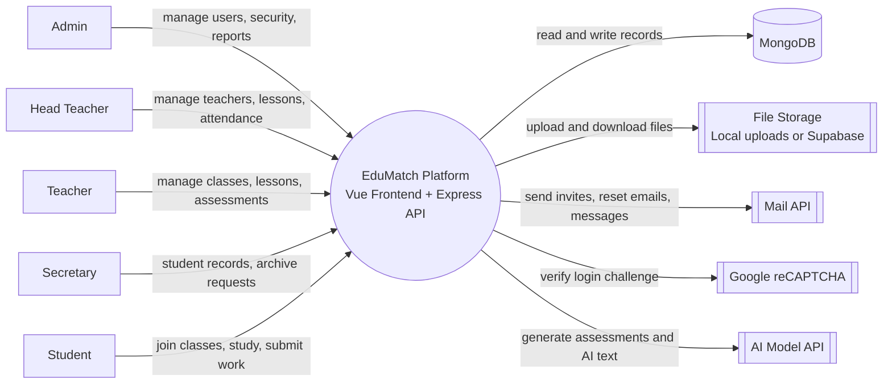
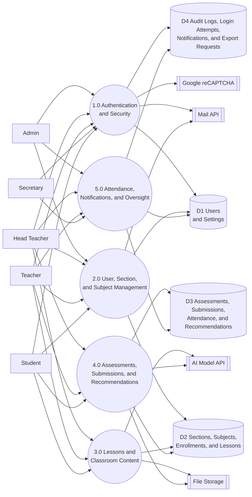

# EduMatch Data Flow Diagram

This is a logical DFD for the current EduMatch codebase. It shows how data moves between users, core processes, data stores, and external services. It is not a deployment diagram.

One arrow may represent both the request and the returned result.

## 1. Context DFD

## 2. Level 1 DFD

## 3. Process Summary

- `1.0 Authentication and Security`: login with reCAPTCHA, JWT access, invite activation, password reset, login-attempt logging, and maintenance enforcement.
- `2.0 User, Section, and Subject Management`: admin and academic staff manage users, advisory sections, handled classes, enrollments, and subject membership.
- `3.0 Lessons and Classroom Content`: teachers and head teachers create lessons, upload attachments, and let students view or download learning materials.
- `4.0 Assessments, Submissions, and Recommendations`: staff create assessments manually or with AI, students take exams or submit activity work, and the system computes scores, progress, and strand recommendations.
- `5.0 Attendance, Notifications, and Oversight`: the system records handled-class and advisory attendance, keeps notifications, logs audit activity, and manages archived-record export approvals.

## 4. Main Data Stores

- `D1 Users and Settings`: `User`, `Settings`, plus access-control state tied to accounts.
- `D2 Sections, Subjects, Enrollments, and Lessons`: `Section`, `Subject`, `SubjectEnrollment`, `Lesson`.
- `D3 Assessments, Submissions, Attendance, and Recommendations`: `Assessment`, `Submission`, `Attendance`, `Recommendation`.
- `D4 Audit Logs, Login Attempts, Notifications, and Export Requests`: `AuditLog`, `LoginAttempt`, `Notification`, `ExportApprovalRequest`, `AdminMessage`.

## 5. External Services

- `Google reCAPTCHA`: validates login requests before authentication succeeds.
- `Mail API`: sends invite emails, password reset emails, and admin-originated messages.
- `File Storage`: stores lesson files, assessment attachments, profile images, and student submission files using local uploads or Supabase Storage.
- `AI Model API`: supports AI-based assessment generation and recommendation-related text generation.

## 6. Codebase Basis

### Backend entry

- `backend/server.js`

### Main routes

- `backend/routes/authRoutes.js`
- `backend/routes/adminRoutes.js`
- `backend/routes/teacherRoutes.js`
- `backend/routes/studentRoutes.js`
- `backend/routes/headteacherRoutes.js`
- `backend/routes/secretaryRoutes.js`
- `backend/routes/notificationRoutes.js`
- `backend/routes/recommendationRoutes.js`
- `backend/routes/storageRoutes.js`

### Main models

- `backend/models/User.js`
- `backend/models/Section.js`
- `backend/models/Subject.js`
- `backend/models/SubjectEnrollment.js`
- `backend/models/Lesson.js`
- `backend/models/Assessment.js`
- `backend/models/Submission.js`
- `backend/models/Attendance.js`
- `backend/models/Recommendation.js`
- `backend/models/AuditLog.js`
- `backend/models/LoginAttempt.js`
- `backend/models/Notification.js`
- `backend/models/ExportApprovalRequest.js`
- `backend/models/AdminMessage.js`
- `backend/models/Settings.js`

### Main integrations

- `backend/services/gmailService.js`
- `backend/services/storageService.js`
- `backend/services/supabaseStorageService.js`
- `backend/controllers/aiController.js`
- `backend/controllers/authController.js`
